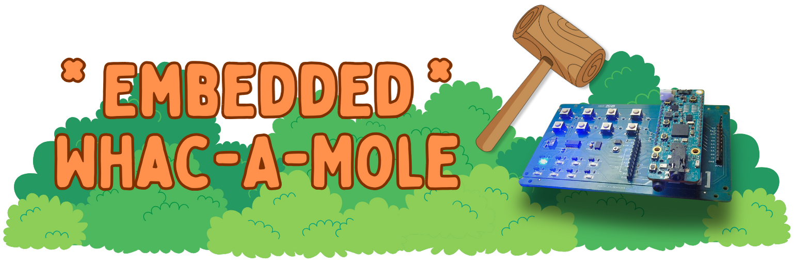

<div align="center">
  <a href="./assets/img/whacamole.png" target="_blank">
    
  </a>
</div>

<br />

<div align="center">

<p>
    A Whac-A-Mole game for Analog Devices'
    <a href="https://www.analog.com/en/products/max32655.html">MAX32655 MCU</a>
</p>

[![License][license-img]][license-url]&nbsp;
[![SDK][sdk-img]][sdk-url]&nbsp;
[![Python][py-img]][py-url]

</div>

[license-img]: https://img.shields.io/github/license/darragh0/emb-whacamole?style=flat-square&logo=apache&label=%20&color=red
[license-url]: https://github.com/darragh0/emb-whacamole?tab=Apache-2.0-1-ov-file
[sdk-img]: https://img.shields.io/badge/MaximSDK-3DB385?style=flat-square&logo=task&logoColor=white
[sdk-url]: https://github.com/analogdevicesinc/msdk
[py-img]: https://img.shields.io/badge/3.12%2B-blue?style=flat-square&logo=python&logoColor=FFFD85
[py-url]: https://www.python.org/

## Components

| Directory    | Description                                                                                           |
| ------------ | ----------------------------------------------------------------------------------------------------- |
| `emb/`       | **FreeRTOS firmware** – Runs game loop; sends JSON events over UART; receives commands from dashboard |
| `agent/`     | **Python UART-MQTT bridge** – Bidirectional relay between device & dashboard                          |
| `dashboard/` | **Web dashboard (as MQTT backend)** – Persists events to JSONL; sends commands to device              |

## Architecture

```
┌──────────────────────────────────────────────────────────────┐
│                  Cloud Server (alderaan)                     │
│   ┌─────────────────┐      ┌────────────────────────────┐    │
│   │    Mosquitto    │<────>│    Dashboard (FastAPI)     │    │
│   │  MQTT Broker    │      │  • Web UI & Device Control │    │
│   │     :1883       │      │  • Live Score Charts       │    │
│   └────────┬────────┘      │  • Game Analytics          │    │
│            │               │  • Leaderboard             │    │
│            │               │         :8088              │    │
│            │               └────────────────────────────┘    │
└────────────┼─────────────────────────────────────────────────┘
             │ MQTT
             │
┌────────────┼───────────┐
│   Laptop   │           │
│  ┌─────────▼────────┐  │
│  │   Python Agent   │  │
│  │  (UART ↔ MQTT)   │  │
│  └─────────┬────────┘  │
└────────────┼───────────┘
             │ USB Serial (115200 baud)
             │
┌────────────▼───────────┐
│  MAX32655 Device       │
│  ┌─────────────────┐   │
│  │    FreeRTOS     │   │
│  │  ┌───────────┐  │   │
│  │  │ Game Task │───────► 5ms polling, deterministic timing
│  │  │   (P3)    │  │   │
│  │  └─────┬─────┘  │   │
│  │        │ Queue  │   │
│  │  ┌─────▼─────┐  │   │
│  │  │Agent Task │  │   │
│  │  │   (P2)    │  │   │
│  │  └───────────┘  │   │
│  └────────┬────────┘   │
│           │ I2C        │
│  ┌────────▼────────┐   │
│  │  MAX7325 GPIO   │   │
│  │  8 LEDs + 8 Btns│   │
│  └─────────────────┘   │
└────────────────────────┘
```

## Protocol

| Direction     | Format               | Example                                                                     |
| ------------- | -------------------- | --------------------------------------------------------------------------- |
| Device → MQTT | JSON events          | `{"event_type":"pop_result","mole_id":3,"outcome":"hit","reaction_ms":245}` |
| MQTT → Device | Single-byte commands | `P` (pause), `R` (reset), `S` (start), `1-8` (level)                        |

## Installation

```bash
# Using uv
uv sync && . ./.venv/bin/activate

# Using pip
python3 -m venv venv && . venv/bin/activate && pip install .
```

See component READMEs for detailed setup.

## License

[Apache-2.0][license-url]
